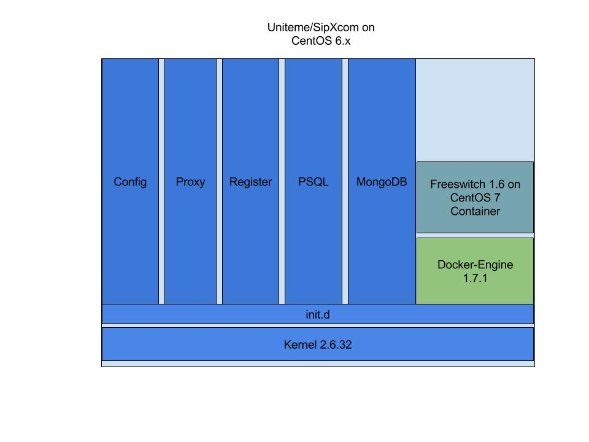
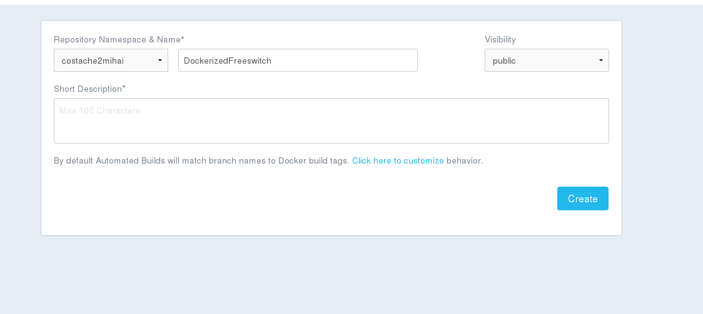

# **DockerizedFreeswitch**

Since containerization and microservices seems to be the way to got in future software production, I’ve decided to take a look at our current sipxcom/uniteme platform and find a way to implement this concept with no core code change.

Dockerization of one service from our enterprise platform without touching the code will require to move that service from init.d  to a container running over docker daemon according to the next figure:



Next hurdle encountered was that “Docker requires a 64-bit OS and version 3.10 or higher of the Linux kernel.” per  https://docs.docker.com/engine/installation/linux/centos/ which is not implemented in our current Centos 6.X base version we are using for Uniteme deployments

This will be one of the things our developers will take into consideration when they will develop a fully containerized solution, but since my Proof of Concept was focused just on containerization of just one element (Freeswitch) I’ve decided to use unsupported version of docker-engine 1.7.1 publised here https://yum.dockerproject.org/repo/main/centos/6/

To add this repository to your currently running uniteme machine you will need to run below commands:
```
tee /etc/yum.repos.d/docker.repo <<-'EOF'
[dockerrepo]
name=Docker Repository
baseurl=https://yum.dockerproject.org/repo/main/centos/7/
enabled=1
gpgcheck=1
gpgkey=https://yum.dockerproject.org/gpg
EOF

yum -y install docker-engine
service docker start
```

Next step will be to remove all freeswitch rpm’s from your Uniteme/SipXcom test machine with:
```
rpm -e $(rpm -qa 'freeswitch*') --nodeps
```


Now all that is needed to have a functional and running freeswitch container will be to execute following command:


```
docker run -d --name="FSContainer" -v /usr/share:/usr/share -v /var/:/var/ -v /etc/sipxpbx:/etc/sipxpbx --net=host --privileged costache2mihai/dockerizedfreeswitch:minimalFS
```

> -d option will run this container in detached mode (like a daemon)

> --name will assign a name of your choice, in my case was FSContainer to be able to manipulate this container with ease

> -v option will mount needed volumes to freeswitch container. You can find which are needed files /directories to be mounted by running ps -ef | grep freeswitch on a machine where freeswitch is running as a service


>--net=host will allow freeswitch that is running inside the container to listen and execute operations directly on the host interface. You could restrict container access by just exposing certain ports that should be used, but for this PoC we just wanted to demonstrate the functionality of mediaservices in a container


>--privileged will  increase container rights to be able to listen directly on host interface


> costache2mihai/dockerizedfreeswitch:minimalFS  is the repository and the tag used by me to publish docker image that we are using in this PoC


Let’s have a look at the Dockerfile used to create docker image:

```
FROM centos:7
MAINTAINER Mihai <costache.mircea.mihai@gmail.com>


RUN yum clean all && \
    yum install -y http://files.freeswitch.org/freeswitch-release-1-6.noarch.rpm epel-release && \
    yum install -y freeswitch-config-vanilla freeswitch-lang-en freeswitch-sounds-en freeswitch-event-erlang-event && \
    yum clean all

CMD freeswitch -nonat -conf /etc/sipxpbx/freeswitch/conf -db \
    /var/sipxdata/tmp/freeswitch -log /var/log/sipxpbx \
    -run /var/run/sipxpbx -htdocs /etc/sipxpbx/freeswitch/conf/htdoc

```

We instruct docker to use a CentOS 7 base image


We will try to keep this image at a minimum so we will only install one language for freeswitch and we will clean yum cache with yum clean all command. Important to note here is that we’ve used && to run all commands in just one step in order to avoid creation of unnecessary intermediary docker images. Instructions on how to install freeswitch on centos 7  can be found here:https://freeswitch.org/confluence/display/FREESWITCH/CentOS+7+and+RHEL+7


Last line in our Dockerfile is the command/entrypoint we will like to be executed when this image will be used by the container. Freeswitch starting command was taken  with the above “ps -ef  | grep freeswitch” procedure from a running uniteme server and you can easily identify what files and folders are needed to be mounted by the docker run command.


**Automate docker build using github VCS**

In order for this dockerfile to become a docker image you will need to run docker build command locally or you can change/pull that Dockerfile, uploaded it to your git repository and use integrated build utility from docker hub.


In my case I have dockerfile uploaded here: https://github.com/Mihai-CMM/DockerizedFreeswitch/blob/minimalFS/Dockerfile


Next in my docker hub account under Create→ Automated Build I’ve selected my github account, next  one will need to point the build tool to the wanted repository, In this case DockerizedFreeswitch


Final step will be to click Create button and now we have also an automated build process on docker hub




**How TO use this PoC**

To use it in SipXcom/Uniteme env :

**1. Remove any sipxfreeswitch rpm's with:**
```
   rpm -e $(rpm -qa 'freeswitch*') --nodeps
```

**2. Build your imagine dockerfile with:**
```
docker build -t {your tag} .
```
**
 Or download this image from docker hub
**

**3. Run it with**
```
docker run -d --name="FSContainer"  -v /usr/share:/usr/share -v /var/:/var/  -v /etc/sipxpbx:/etc/sipxpbx --net=host --privileged
```

Note:
> This is a complete dockerized FS image that you can use it as you like, above example is used as PoC in  SipXcom Unified Communication server where FS is used as mediaserver


